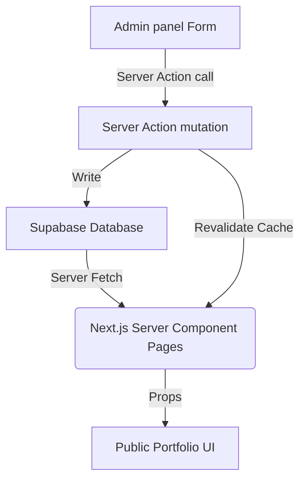

# Application Architecture

This document describes the design, directory structure, data flow, caching mechanisms, SEO strategies, and admin infrastructure for the Obsidian & Ether developer portfolio built using **Next.js 16 (App Router)**, **TypeScript**, **Tailwind CSS v4**, **shadcn/ui**, **Framer Motion**, and **Supabase**.

---

## 1. Directory Structure

We use the recommended directory structure with all source code residing in `src/`.

```text
src/
├── app/                      # Next.js App Router pages, layouts, and API routes
│   ├── (public)/             # Group route for public-facing portfolio pages
│   │   ├── page.tsx          # Home page (sections combined)
│   │   ├── projects/[slug]/  # Dynamic project case study pages
│   │   └── layout.tsx        # Public layout (contains Navbar and Footer)
│   ├── (auth)/               # Auth routes
│   │   └── login/            # Admin login screen
│   ├── admin/                # Group route for admin panel (protected by middleware)
│   │   ├── page.tsx          # Admin dashboard
│   │   ├── projects/         # CRUD views for projects
│   │   ├── experience/       # CRUD views for work history
│   │   ├── education/        # CRUD views for academic history
│   │   ├── skills/           # CRUD views for skill tags
│   │   ├── about/            # Admin view for About section content
│   │   └── layout.tsx        # Admin layout (dashboard sidebar, header)
│   ├── layout.tsx            # Global layout (HTML template, Font injection)
│   ├── globals.css           # Tailwind v4 globals and design system vars
│   ├── sitemap.ts            # Dynamic sitemap generator
│   └── robots.ts             # robots.txt config
├── components/
│   ├── ui/                   # Reusable atomic shadcn/ui components (buttons, dialogs, inputs)
│   ├── layout/               # Shared global layouts (Navbar, Footer, MobileNav)
│   ├── sections/             # Specific homepage section wrappers (Hero, About, Skills, etc.)
│   ├── portfolio/            # Shared portfolio elements (ProjectCard, TimelineItem, SkillCard)
│   └── admin/                # Admin panel elements (AdminSidebar, AdminHeader, MediaUploader)
├── lib/
│   ├── supabase/             # Supabase clients (client, server, middleware client helpers)
│   │   ├── client.ts         # Browser-safe client
│   │   ├── server.ts         # Server component client
│   │   └── middleware.ts     # Middleware client
│   └── utils/                # Tailwind merge and styling utils
├── hooks/                    # Custom React hooks (e.g., useAuth)
├── types/                    # TypeScript interfaces (Database types, models)
├── actions/                  # Next.js Server Actions for CRUD and mutations
├── constants/                # Static data arrays and config variables
└── styles/                   # Custom stylesheet overrides (if necessary)
```

---

## 2. Routing System

### Public Routes
- `/`: Renders all sections (Hero, About, Skills, Projects, Experience, Education, Contact).
- `/projects/[slug]`: Shows detailed Case Study (overview, stack, challenges, architecture).

### Auth & Protected Routes
- `/login`: Admin login form using Supabase email/password authentication.
- `/admin`: Dashboard landing page.
- `/admin/projects`: Project listing and creation/edition views.
- `/admin/experience` & `/admin/education`: Timeline listing and edit panels.
- `/admin/skills`: Simple list editor for technical stack tags.
- `/admin/about`: Form to modify about content.

---

## 3. Data Flow & State Management

The application operates on a **Server-First Data Flow** to ensure high performance and SEO capability.



### Data Fetching (Read)
- Public routes (`/` and `/projects/[slug]`) are Next.js **Server Components**. They fetch data directly from Supabase via `lib/supabase/server.ts` during server-side rendering.
- No client-side `useEffect` fetches are used on the public site, minimizing hydration layouts and rendering delays.

### Data Mutation (Write)
- Admin pages use interactive client forms that invoke Next.js **Server Actions** (`actions/`).
- Actions validate payload inputs, communicate with Supabase, execute transactions, and trigger cached route updates via `revalidatePath`.

---

## 4. Admin Infrastructure & Security

### Authentication
- Authenticated with **Supabase Auth** using email/password.
- Session tokens are stored in secure cookies handled automatically by `@supabase/ssr`.

### Middleware Protection
- Next.js Edge middleware (`src/middleware.ts`) inspects sessions for all requests hitting `/admin/*`.
- Unauthenticated requests are immediately redirected to `/login`.
- Session state is kept fresh by updating cookies in the middleware loop.

---

## 5. Caching & Revalidation Strategy

To hit performance targets (Lighthouse >95) and minimize Supabase quota consumption:

- **Static-By-Default:** Both `/` and `/projects/[slug]` routes are statically rendered at build time using Next.js caching.
- **On-Demand Revalidation (ISR):**
  - When an admin saves changes (e.g., editing a project or updating skills), the associated Server Action triggers:
    ```typescript
    revalidatePath("/");
    revalidatePath(`/projects/${projectSlug}`);
    ```
  - This immediately purge-rebuilds the cached version on Vercel's CDN Edge.
- **Client Caching:** React Server Components avoid layout-level client state, preserving browser-side memory.

---

## 6. SEO Strategy

- **Metadata API:** Global layouts define default OpenGraph, Twitter Cards, description, and page title parameters.
- **Dynamic SEO:** `/projects/[slug]` implements `generateMetadata()` to fetch project details from the database and generate custom OG titles and descriptions matching the case study.
- **Structured Data (JSON-LD):** Portfolio incorporates Schema.org micro-data.
  - Homepage embeds a `Person` schema containing skills, location, and social links.
  - Project page embeds a `CreativeWork` (or `TechArticle`) schema detailing case studies.
- **Sitemap & Robots:** Dynamic generation in `/sitemap.ts` listing all active project slugs dynamically from database records.
